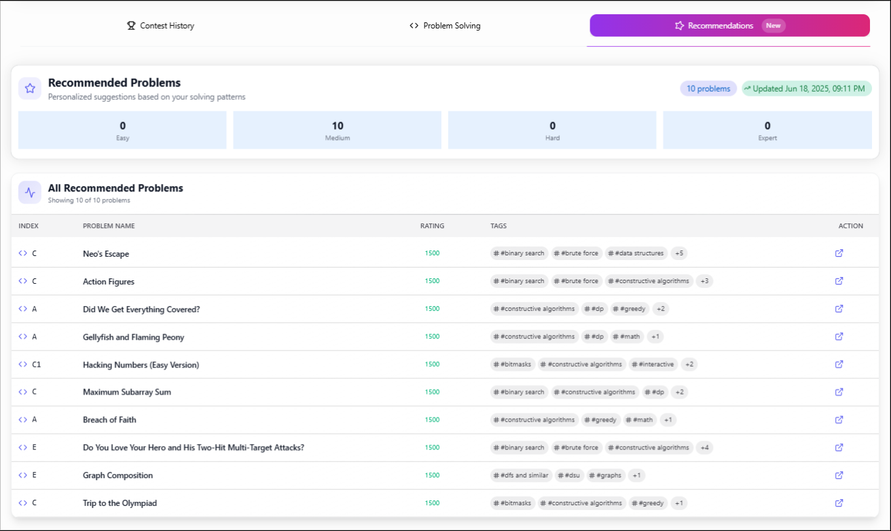

# Student Progress Management System (SPMS)

A comprehensive web application for tracking and managing competitive programming student progress with automated Codeforces data synchronization, analytics, and intelligent notifications.

## Live Demo

**Live Application:** [https://spms-by-tle.vercel.app](https://spms-by-tle.vercel.app)

**Video Demo:** [Watch Full Demo](https://youtu.be/demo-video-link)

## Table of Contents

- [Features](#features)
- [Technology Stack](#technology-stack)
- [Architecture](#architecture)
- [Installation](#installation)
- [Configuration](#configuration)
- [API Documentation](#api-documentation)
- [Database Schema](#database-schema)
- [Cron Jobs](#cron-jobs)
- [Email System](#email-system)
- [Contributing](#contributing)
- [Screenshots](#screenshots)
- [License](#license)
- [Support](#support)
- [Acknowledgments](#acknowledgments)

## Features

### Core Functionality

- **Student Management**: Complete CRUD operations for student profiles
- **Codeforces Integration**: Automated data synchronization with Codeforces API
- **Progress Analytics**: Comprehensive analysis of competitive programming progress
- **Contest Tracking**: Detailed contest history with performance metrics
- **Problem Solving Analysis**: Advanced analytics with visual representations
- **Inactivity Detection**: Automated email notifications for inactive students
- **Data Export**: CSV export functionality for all student data

### Advanced Features

- **Personalized Recommendations**: Daily problem recommendations based on student performance
- **Real-time Sync**: Immediate data updates when student handles are modified
- **Configurable Scheduling**: Customizable cron job timing and frequency
- **Email Management**: Individual email notification controls
- **Responsive Design**: Mobile and tablet optimized interface
- **Dark Mode**: Complete light/dark theme support
- **Authentication**: Secure user authentication and authorization

### Analytics & Visualizations

- **Rating Progression**: Interactive charts showing rating changes over time
- **Contest Performance**: Detailed contest analysis with ranking and problem-solving metrics
- **Problem Distribution**: Visual breakdown of problems solved by difficulty and category
- **Submission Heatmap**: GitHub-style activity calendar
- **Performance Metrics**: Comprehensive statistics and trend analysis

## Technology Stack

### Frontend
- **React** with TypeScript
- **Tailwind CSS** for styling
- **NextUI** for component library
- **Framer Motion** for animations
- **React Google Charts** for data visualization
- **React Activity Calendar** for heatmap visualization

### Backend
- **Node.js** with Express.js
- **TypeScript** for type safety
- **MongoDB** with Mongoose ODM
- **JWT** for authentication
- **Node-cron** for scheduled tasks
- **Nodemailer** for email services
- **Axios** for HTTP requests

### DevOps & Tools
- **GitHub Actions** for CI/CD
- **ESLint** and **Prettier** for code quality
- **Postman** for API testing

## Architecture

### System Architecture

```
┌─────────────────┐    ┌─────────────────┐    ┌─────────────────┐
│   Frontend      │    │   Backend       │    │   Database      │
│   (React)       │◄──►│   (Node/Express)│◄──►│   (MongoDB)     │
└─────────────────┘    └─────────────────┘    └─────────────────┘
                              │
                              ▼
                    ┌─────────────────┐
                    │  External APIs  │
                    │  (Codeforces)   │
                    └─────────────────┘
                              │
                              ▼
                    ┌─────────────────┐
                    │  Email Service  │
                    │  (Nodemailer)   │
                    └─────────────────┘
```

### Data Flow

1. **User Registration/Login**: JWT-based authentication
2. **Student Management**: CRUD operations with real-time validation
3. **Data Synchronization**: Scheduled and on-demand Codeforces API calls
4. **Analytics Processing**: Real-time calculation of metrics and statistics
5. **Notification System**: Automated email alerts for inactive students

## Installation

### Prerequisites

- Node.js (v18 or higher)
- MongoDB (v5.0 or higher)
- npm package manager

### Local Development Setup

1. **Clone the repository**
```bash
git clone https://github.com/devendrasuryavanshi/SPMS_by_TLE.git
cd SPMS
```

2. **Install dependencies**
```bash
# Install server dependencies
cd server
npm install

# Install client dependencies
cd ../client
npm install
```

3. **Environment Configuration**

Create `.env` files in both server and client directories:

**Server (.env)**
```env
# Server Configuration
NODE_ENV=development
PORT=3000

# Database Configuration
MONGODB_URI=

# JWT Configuration
JWT_SECRET=
JWT_EXPIRES_IN=7d

# CORS Configuration
SERVER_URL=http://localhost:3000
CLIENT_URL=http://localhost:5173

# Email Configuration
SMTP_HOST=smtp.gmail.com
SMTP_PORT=587
SMTP_USER=your-email@gmail.com
SMTP_PASS=app_password

TZ=Asia/Kolkata
```

**Client (.env.local)**
```env
VITE_SERVER_URL=http://localhost:3000
VITE_API_URL=http://localhost:3000/api
```

4. **Start the application**
```bash
# Start server (from server directory)
npm run dev

# Start client (from client directory)
npm run dev
```

The application will be available at:
- Frontend: http://localhost:5173
- Backend API: http://localhost:3000

## Configuration

### Environment Variables

| Variable | Description | Default |
|----------|-------------|---------|
| `NODE_ENV` | Application environment | development |
| `PORT` | Server port | 5000 |
| `MONGODB_URI` | MongoDB connection string | mongodb://localhost:27017/spms |
| `JWT_SECRET` | JWT signing secret | - |
| `JWT_EXPIRE` | JWT expiration time | 7d |
| `SMTP_HOST` | Email server host | smtp.gmail.com |
| `SMTP_PORT` | Email server port | 587 |
| `DEFAULT_SYNC_SCHEDULE` | Default cron schedule | 0 2 * * * |

### Cron Job Configuration

The system supports configurable cron schedules for data synchronization:

```javascript
// Examples of cron schedules
"0 2 * * *"     // Daily at 2:00 AM
"0 */6 * * *"   // Every 6 hours
"0 0 * * 0"     // Weekly on Sunday at midnight
```

## API Documentation

### Authentication Endpoints

#### POST /api/auth/login
Authenticate user and receive JWT token.

**Request Body:**
```json
{
  "email": "user@example.com",
  "password": "securePassword123"
}
```

### Student Management Endpoints

#### GET /api/students
Retrieve paginated list of students with filtering and sorting.

**Query Parameters:**
- `page` (number): Page number (default: 1)
- `limit` (number): Items per page (default: 50)
- `search` (string): Search term for name, email, or handle
- `sortBy` (string): Sort field (name, rating, email, etc.)
- `order` (string): Sort order (asc, desc)

**Response:**
```json
{
  "success": true,
  "totalCount": 150,
  "totalPages": 3,
  "currentPage": 1,
  "students": [
    {
      "_id": "student_id",
      "name": "John Doe",
      "email": "john@example.com",
      "phoneNumber": "+1 234 567 8900",
      "codeforcesHandle": "johndoe",
      "rating": 1500,
      "maxRating": 1650,
      "rank": "specialist",
      "isActive": true,
      "lastDataSync": "2024-01-15T10:30:00Z"
    }
  ]
}
```

#### POST /api/students
Create a new student profile.

**Request Body:**
```json
{
  "name": "John Doe",
  "email": "john@example.com",
  "phone": "+1 234 567 8900",
  "codeforcesHandle": "johndoe"
}
```

#### GET /api/students/:id
Retrieve detailed student profile with analytics.

#### PUT /api/students/:id
Update student information.

#### DELETE /api/students/:id
Delete student profile and all associated data.

### Analytics Endpoints

#### GET /api/students/:id/contest-history
Retrieve contest participation history with filtering.

**Query Parameters:**
- `days` (number): Filter by days (30, 90, 365)

**Response:**
```json
{
  "success": true,
  "data": {
    "contests": [
      {
        "contestId": 1234,
        "contestName": "Codeforces Round #800",
        "participationDate": "2024-01-10T14:35:00Z",
        "rank": 1250,
        "ratingChange": 25,
        "newRating": 1525,
        "problemsSolved": 3,
        "totalProblems": 5
      }
    ],
    "ratingProgression": [
      {
        "date": "2024-01-10",
        "rating": 1525,
        "change": 25
      }
    ],
    "statistics": {
      "totalContests": 15,
      "averageRank": 1200,
      "bestRank": 450,
      "ratingGain": 150
    },
    "filterInfo": {
      "days": 30,
      "dateFrom": "2024-01-01",
      "dateTo": "2024-01-30"
    }
  }
}
```

#### GET /api/students/:id/problem-solving
Retrieve problem-solving analytics with filtering.

**Query Parameters:**
- `days` (number): Filter by days (7, 30, 90)

### Synchronization Endpoints

#### POST /api/sync/all
Trigger manual synchronization for all students.

#### POST /api/sync/student/:id
Trigger manual synchronization for specific student.

#### GET /api/sync/settings
Retrieve current synchronization settings.

#### PUT /api/sync/settings
Update synchronization schedule.

**Request Body:**
```json
{
  "cronSchedule": "0 3 * * *"
}
```

## Database Schema

### User Schema
```javascript
{
  name: string;
  email: string;
  password: string;
  role: 'admin' | 'student';
  adminConfig: {
    hasEditAccess: boolean;
    hasDeleteAccess: boolean;
    hasCritialAccess: boolean;
  }
  createdAt: Date,
  updatedAt: Date
}
```

### Student Schema
```javascript
{
  name: string;
  avatarUrl: string;
  email: string;
  phoneNumber: string;
  codeforcesHandle: string;
  rating: number;
  maxRating: number;
  rank: string;
  country: string;
  lastSubmissionTime?: Date;
  lastContestTime: Date;
  lastDataSync: Date;
  syncStatus: string;
  lastInactivityEmailSent?: Date;
  inactivityEmailCount: number;
  autoEmailEnabled: boolean;
  createdAt: Date;
  updatedAt: Date;
}
```

### Contest Schema
```javascript
{
  _id: ObjectId,
  studentId: mongoose.Types.ObjectId;
  contestId: number;
  contestName: string;
  ratingChange: number;
  oldRating: number;
  newRating: number;
  rank: number;
  contestTime: Date;
  totalProblems: number;
  problemsUnsolvedCount: number;
  createdAt: Date;
  updatedAt: Date;
}
```

### Submission Schema
```javascript
{
  studentId: mongoose.Types.ObjectId;
  submissionId: number;
  problemId: string;
  problemIndex: string;
  problemName: string;
  problemRating: number;
  verdict: string;
  submissionTime: Date;
  solved: boolean;
  tags: string[];
  createdAt: Date;
  updatedAt: Date;
}
```

### System Settings Schema
```javascript
{
  cronSchedule: string;
  scheduleInput: string;
  isAutoSyncEnabled: boolean;
  lastSyncDate: Date;
  lastUpdatedBy: mongoose.Types.ObjectId;
  updatedAt: Date;
}
```

### Recommended Problems Schema
```javascript
{
  studentId: mongoose.Types.ObjectId;
  problems: {
    problemId: string;
    problemName: string;
    problemIndex: string;
    problemRating: number;
    tags: string[];
  }
  createdAt: Date;
  updatedAt: Date;
}
```

## Cron Jobs

### Data Synchronization Job

The system implements automated data synchronization using node-cron:

### Features:
- **Configurable Schedule**: Administrators can modify the cron schedule
- **Error Handling**: Comprehensive error logging and recovery
- **Rate Limiting**: Respects Codeforces API rate limits
- **Batch Processing**: Processes students in batches to avoid timeouts
- **Monitoring**: Detailed logging and status tracking

## Email System

### Inactivity Notification System

The system automatically detects inactive students and sends personalized email reminders:

### Email Features:
- **Personalized Content**: Dynamic content based on student data
- **Retry Logic**: Automatic retry on failure with exponential backoff
- **Individual Controls**: Students can disable automatic emails
- **Tracking**: Email count tracking per student
- **Templates**: Customizable email templates

## Performance Optimization

- Caching Strategy

- Database Optimization

- API Rate Limiting

## Security Implementation

- Authentication & Authorization

- Data Validation


## Monitoring and Logging

### Application Monitoring

```javascript
// Winston logger configuration
const winston = require('winston');

const logger = winston.createLogger({
  level: 'info',
  format: winston.format.combine(
    winston.format.timestamp(),
    winston.format.errors({ stack: true }),
    winston.format.json()
  ),
  transports: [
    new winston.transports.File({ filename: 'logs/error.log', level: 'error' }),
    new winston.transports.File({ filename: 'logs/combined.log' }),
    new winston.transports.Console({
      format: winston.format.simple()
    })
  ]
});
```

## Contributing

### Development Workflow

1. **Fork the repository**
2. **Create a feature branch**
   ```bash
   git checkout -b feature/amazing-feature
   ```
3. **Make your changes**
4. **Add tests for new functionality**
5. **Run the test suite**
   ```bash
   npm test
   ```
6. **Commit your changes**
   ```bash
   git commit -m "Add amazing feature"
   ```
7. **Push to your branch**
   ```bash
   git push origin feature/amazing-feature
   ```
8. **Open a Pull Request**

## Screenshots

### Student Management


### Student Profile Analytics


### Contest History Analysis


### Problem Solving Analytics


### Problem Recommendations


### System Settings


## License

This project is licensed under the MIT License - see the [LICENSE](LICENSE) file for details.

## Support

For support and questions:

- **Email**: devendrasooryavanshee@gmail.com

- **Documentation**: [https://github.com/devendrasuryavanshi/SPMS_by_TLE/blob/main/README.md](https://github.com/devendrasuryavanshi/SPMS_by_TLE/blob/main/README.md)
- **Issues**: [GitHub Issues](https://github.com/devendrasuryavanshi/SPMS_by_TLE/issues)
- **Discussions**: [GitHub Discussions](https://github.com/devendrasuryavanshi/SPMS_by_TLE/discussions)

## Acknowledgments

- **TLE Eliminators** for the project requirements and this opportunity
- **Codeforces** for providing the competitive programming data API
- **Open Source Community** for the amazing tools and libraries used in this project

---

**Built with ❤️ for the competitive programming community by DEVENDRA SURYAVANSHI**
